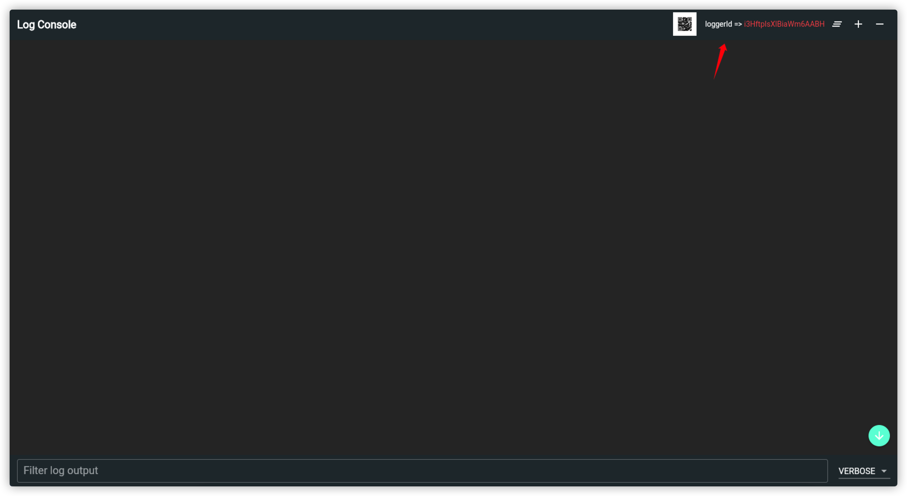
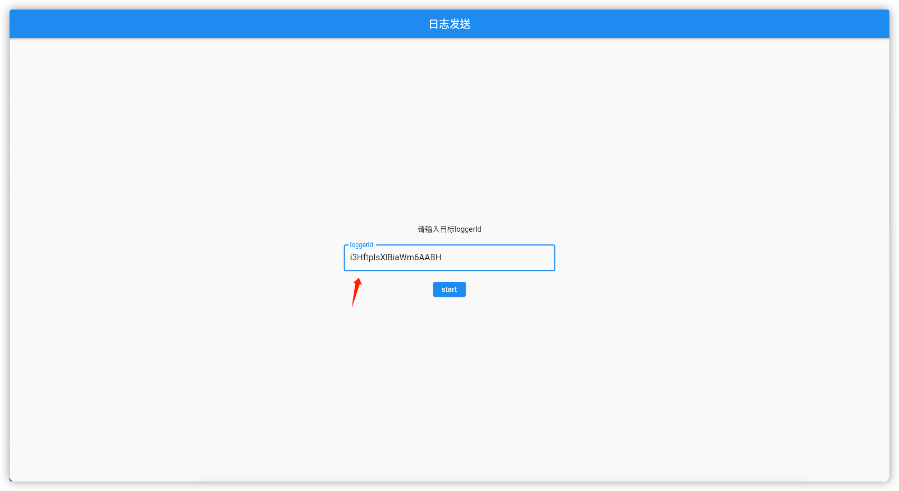
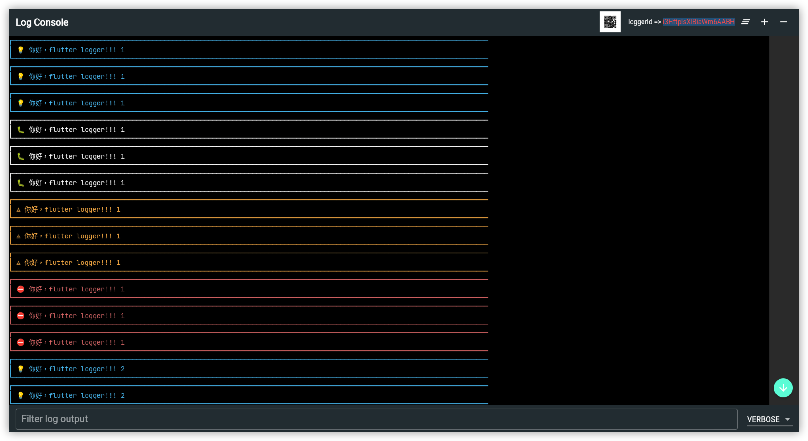

# 背景

手机App打包安装后，开发、测试有时要查看程序的实时日志输出，来定位和排查问题。  
一般选择在App内集成一个小的console界面来打印日志，但是受限于屏幕尺寸，查看和搜索日志都不太方便。  
能不能把手机App的运行日志实时打印到PC屏幕上来进行分析呢？  
flutter_socket_logger 可以帮你快速实现这个功能！  

# 特性

* 支持按日志级别和输入关键字过滤日志
* 在同一个网络内，扫描二维码或输入loggerId可快速连接到不同PC上的日志浏览器查看日志
* 日志界面基于Flutter开发，可以快速部署到PC、浏览器、手机上，显示体验一致
* 支持ANSI Color颜色文本输出
* 功能无缝对接[dart logger库](https://pub.dev/packages/logger)

# 安装部署

假定部署到 {host}

1. 启动转发服务
```sh
$ cd logger_server
$ npm run app
```
转发服务默认在 http://{host}:3001，配置nginx反向代理，通过 https://{host}/ 访问

2. 部署日志浏览器
```sh
$ cd logger_browser
$ flutter build web --base-href /logger/browser/
$ cp -R build/web  {webroot}
```
配置nginx，通过 https://{host}/logger/browser/ 访问

1. 部署日志发送工具（用于测试）
```sh
$ cd logger_writer
$ flutter build web --base-href /logger/writer/
$ cp -R build/web  {webroot}
```
配置nginx，通过 https://{host}/logger/writer/ 访问

# 快速体验
1. 在PC添加并信任证书 server.crt （如使用自签名证书）
2. 在PC浏览器上打开日志浏览器  https://{host}/logger/browser/
3. 在PC浏览器上打开日志发送工具 https://{host}/logger/writer/
4. 记录下日志浏览器上的loggerId，在日志发送工具中输入，点击【start】后就可以在日志浏览器上看到发送工具打印的日志







# 使用方法 

1. 在Flutter App中添加依赖package：flutter_socket_logger
2. 创建 SocketOutput，并添加到Logger （可以通过扫码或复制的方式获取日志浏览器loggerId）
3. 用Logger正常打日志即可在浏览器中远程查看日志输出


```dart
import 'package:flutter_socket_logger/flutter_socket_logger.dart';
 
SocketOutput output = SocketOutput(
        url: serverUrl, //日志转发服务地址，部署在 https://100.118.56.61
        peer: peer,     //日志浏览器的loggerId
        onBind: (ok) {  //绑定日志浏览器回调
        });
 
Logger logger = Logger(
        output: MultiOutput([output, ConsoleOutput()]),
        filter: ProductFilter());   //Logger默认的Filter在release包中不打印日志，如需打印可以使用我们提供的ProductFilter
 
logger.d('你好，flutter logger!!!');
```

更详细使用例子可以参考 logger_writer 

# 参考
[flutter_socket_logger代码仓库](https://github.com/victor-imlj/flutter_socket_logger)